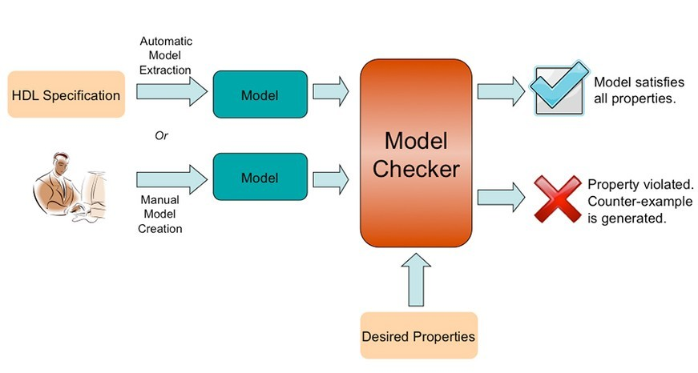
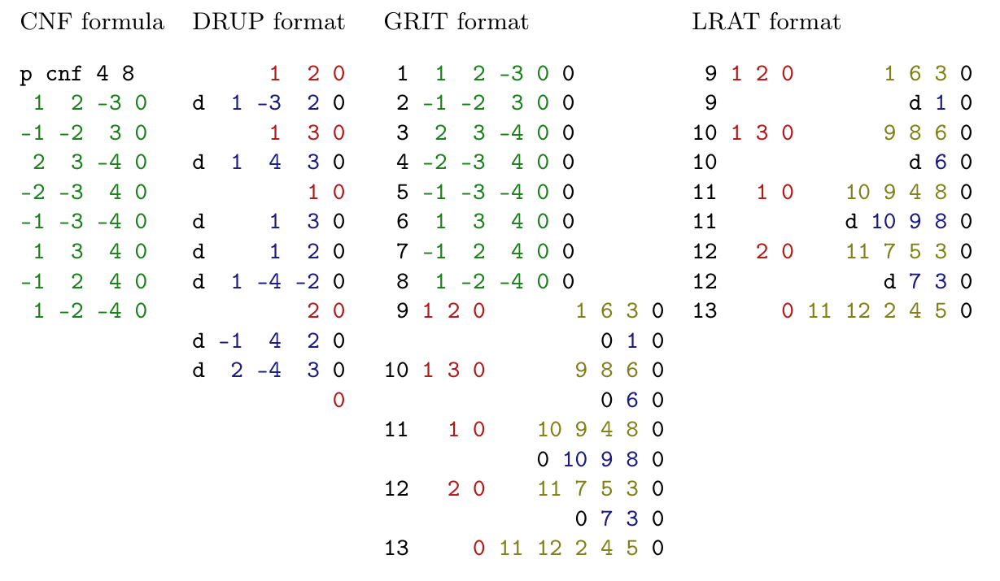

---
theme:
  name: dark
title: Towards a Verified CDCL SAT Solver in Lean
author: Arjun S. Bhamra and Cameron C. Hoechst
---

Verifying SAT Solvers; why care?
---

<!--
This is a multi-line comment.
use pause command for two-step slides
-->

SAT solvers are used in a variety of mission-critical applications:
- Hardware Verification
- Program Synthesis
- Other general formal verification systems
- Much more



<!-- pause -->

**These applications care about how trustworthy SAT solvers' results are**

<!-- pause -->

Verification is a way to make sure we can trust solvers. It also allows us to directly implement formal specifications of algorithms in a cleaner manner, such as a CDCL calculus.


<!-- end_slide -->

How can we verify SAT solvers?
---

<!-- column_layout: [1, 1] -->

<!-- column: 0 -->
There are two main ways to do so:
- *Trust-but-verify*: Design a fast SAT solver that then generates a *proof trace* - an output format that can be checked to ensure output correctness, especially in the UNSAT case. 
  + Then, by integrating the solver with a verified trace checker (that has a smaller code surface), we can still trust that the output is correct!
  + There are a few proof trace formats, but the most common used in SAT competitions are Deletion-Resolution Asymmetric Tautologies (**DRAT**) and Linear RAT (**LRAT**).

<!-- column: 1 -->


<!-- pause -->

<!-- reset_layout -->
- *Full formal verification*: Use an interactive theorem prover (ITP) to build up provably correct data structures and related functions that interact correctly based on *invariants* that are maintained via **lemmas** and **theorems**
  - If the code compiles, then it usually works
  - Can build up a formalism piece by piece
  - Some ITPs will automatically complain about termination conditions, etc., which are crucial for SAT solvers in their own right

<!-- end_slide -->

Our Contribution: CDCL in Lean (with some proofs!)
---
Over the course of our project, we designed a series of:
- Data Structures
- An implementation of overall flow/structure of CDCL in Lean
  - We used the 1-UIP conflict driven clause learning scheme
  - We also leveraged the VSIDS decision heuristic for improved BCP, perf
- Proofs for
  1. The termination of BCP
  2. Getting closer to showing the termination of the recursive 1-UIP scheme
  3. Other glue methods building up to this idea

<!-- pause -->

## In proving things about BCP and 1-UIP, we made some headway towards the no-relearning theorem, which states that *no clause can be learned twice*

<!-- pause -->

# In the next few slides, we'll go over some specifics!

<!-- end_slide -->

Data Structures
---
# Basics
```lean +line_numbers
abbrev Var := Nat
abbrev Lit := Int
```
## Clauses
```lean +line_numbers
structure Clause where
  lits    : Array Lit
  learnt  : Bool := false -- default
  deriving Repr, Inhabited
```
### Clause Database
```lean +line_numbers
structure ClauseDB (nc : Nat) where
  clauses : Vector Clause nc -- indices >= #vars -> learnt clauses.
  num_unassigned : Vector Nat nc := clauses.map (λ c => c.lits.size)
  deriving Repr
```

<!-- end_slide -->

Data Structures (cont.)
---
## Assignment Trail (via Stack)
```lean +line_numbers
inductive Stack (α : Type) where
  | empty : Stack α
  | push : α → Stack α → Stack α
  deriving Repr
  
def push {α : Type} (x : α) (s : Stack α) : Stack α :=
  Stack.push x s

def Stack.top {α : Type} : Stack α → Option α
  | empty => none
  | push x _ => some x

-- Other helpers like pop, isEmpty, size, etc.
```

```lean +line_numbers
structure AssignmentTrail where
  stack : Stack (Lit × Nat) := Stack.empty
```
<!-- end_slide -->

Data Structures (even more)
---
# Resolution Tree (for proofs)
```lean +line_numbers
inductive ResolutionTree where
  /- Leaves are clauses from the original formula, we only
     start with leaves and build up conflict clauses + our
     resolution tree from there
  -/
  | leaf    (clauseIdx : Nat)
  | resolve (pivotVar  : Var)
            (pivotSign : Bool) -- T => l has piv, r has ¬piv
            (left      : ResolutionTree)
            (right     : ResolutionTree)
```

<!-- end_slide -->

The SAT Solver's Structure
---
Solver is parameterized with the number of variables `nv` and the number of clauses in an "unknown" state `nc`
```lean +line_numbers
structure Solver (nv nc : Nat) where
  clauses       : ClauseDB nc
  assignment    : Assignment nv
  decision_lvl  : Nat := 0
  trail         : AssignmentTrail
  -- Stores indices to clauses in ClauseDB
  is_satisfied  : Vector Bool nc := Vector.replicate nc false
  -- How many clauses are still in the "unknown" state?
  contingent_ct : Nat := nc
  -- Stores clause whose unit status led to propagation. prop_reason[n] = m → n is forced to ⊤/⊥ because of clause m.
  prop_reason   : Vector (Option Nat) nv := Vector.replicate nv none 
  activity      : VsidsActivity
  -- rtree      : ResolutionTree
```

<!-- end_slide -->

The SAT Solver's Structure: Interconnects
---
The rest of the solver works as described via coursework; there is a BCP invocation, followed by an `analyzeConflict` subroutine that updates activities for the Variable State Independent Decaying Sum (VSIDS) decision heuristic and then uses the 1-UIP framework to learn a new conflict clause, before determining the backjump level.

If we know the backjump level is 0, we have reached a contradiction at the root of the formula and we return UNSAT with our `ResolutionTree`. Otherwise, we can proceed as normal after rolling back our assignments via the `backjump` function. 

<!-- end_slide -->

Proofs for BCP
---
Describe where we are currently at w.r.t progress, what we have and haven't proved!

# TODO: CAMERON FINISH THIS WHEN U CAN

## Also split this over a few slides

<!-- end_slide -->

Proofs for 1-UIP
---
Below is the core of the recursive algorithm that implements 1-UIP:
```lean +line_numbers
  let rec loop (s : Solver nv nc) (curr : Clause) (seen : Std.HashSet Nat)
    (h_curr_assigned : ∀ l ∈ curr.lits, containsVar l.var s.trail.stack = true) : (Solver nv nc × Clause) :=
    let lits_at_dl :=

    -- We do a bunch of cool stuff here, per 1-UIP

  termination_by s.trail.size
```

# Our core proofs for the 1-UIP subroutine thus far revolve around proving things surrounding the `popVar` function, to show that our trail size is guaranteed to decrease to a base case.

```lean +line_numbers
-- takes stack, var (nat), pops literal referred to by var
def popVar (t : AssignmentTrail) (v : CDCL.Var) : AssignmentTrail :=
  let rec loop (s acc : Stack (CDCL.Lit × Nat)) : Stack (CDCL.Lit × Nat) :=
  match s with
  | Stack.empty => acc -- didn't find var, return accumulated
  | Stack.push (lit, dl) rest =>
    if lit.var == v then
      Stack.pushAll acc rest
    else
      loop rest (Stack.push (lit, dl) acc)
  { t with stack := loop t.stack Stack.empty }
```

<!-- end_slide -->

Proofs for 1-UIP (even more)
---
This function works by ignoring variables that aren't the one we search for, and if it finds a matching variable, will concatenate the previous section with the latter section, effectively removing the selected variable. By inspection, we can clearly see that this is true by cases, so we apply a similar technique to the proofs.

---
```lean +line_numbers
-- popVar's loop size <= the input loop size (either -1 or stays same)
lemma loop_size (v : CDCL.Var) : ∀ (s acc : Stack (CDCL.Lit × Nat)),
  if containsVar v s then
    (popVar.loop v s acc).size = s.size + acc.size - 1
  else (popVar.loop v s acc).size = s.size + acc.size
  | Stack.empty, acc =>
    by simp [AssignmentTrail.popVar.loop, containsVar, Stack.size]
  | Stack.push (l, dl) rest, acc =>
    by
      by_cases h : l.var == v
      · simp[AssignmentTrail.popVar.loop, containsVar, h, Stack.size, size_pushAll, Nat.add_comm]
        omega -- simplify arithmetic then do IH
      · simp only [containsVar, popVar.loop, h, Stack.size]
        have ih := loop_size v rest (Stack.push (l, dl) acc)
        simp only [Stack.size] at ih
        convert ih using 2 <;> omega
```
---

<!-- end_slide -->

Proofs for 1-UIP (last one)
---
Using the `loop_size` lemma, we can easily extend this to the proper `popVar` function, and we add a key hypothesis that the variable we want to pop is contained within the trail; this allows us to show that `(t.popVar v).size < t.size`, with the hope of applying this to `s.trail` for solver `s`.

---
```lean +line_numbers
lemma popVar_size_lt_containsVar (t : AssignmentTrail) (v : CDCL.Var)
  (hcv : containsVar v t.stack = true) : (t.popVar v).size < t.size := by
  unfold popVar
  have h := loop_size v t.stack Stack.empty
  simp only [Stack.size, size] at h ⊢
  split_ifs at h
  · have hpos := containsVar_true_nonempty v t.stack hcv
    omega
```

<!-- end_slide -->

Strategies for proving No Relearning
---
Our original goal was to prove this, but we have had challenges with proving BCP and 1-UIP, unfortunately leading to minimal progress on this front. That being said, based on our developments in previous slides, we have some forward momentum in tackling the no relearning proof. 

<!-- pause -->
---
The approach taken in Fleury's work relies on the internalization of the formal CDCL calculus being used; we believe that with our intermediary invariants regarding BCP, 1-UIP, and the data structures we've chosen to use (largely sets, stacks, and arrays with verified monotonic operations), we can show via induction and similar reductions that it is impossible to generate the same learned clause twice via 1-UIP.


<!-- end_slide -->

Experimental Evaluation
---
Owing to previously mentioned development challenges, our evaluation is limited to simple, handwritten Boolean formulas to verify functionality of our core subroutines, namely BCP, 1-UIP, and a more complex instance that involves nontrivial application of both via the solver while guaranteeing termination. A few of these simple examples are below, and the rest can be found in our examples file.

[](https://github.com/abhamra/verified-CDCL-datastructures/blob/main/VerifiedCdclDatastructures/Examples.lean)
<!-- pause -->

---
<!-- column_layout: [1, 1] -->
<!-- column: 0 -->
Below is an example of an UNSAT case:
```Lean
-- x1 ∧ ¬x1 (via CNF)
def unsat_example : CDCL.Formula 2 :=
  { num_vars := 1, clauses := #[ {lits := #[1] }, { lits := #[-1] } ].toVector }
```

We also showcase a slightly more involved example related to the `AssignmentTrail`'s `popVar` subroutine, which is key in proving termination of 1-UIP -->

<!-- column: 1 -->
```Lean
-- check for popVar
def l1 : CDCL.Lit := 1
def l2 : CDCL.Lit := -2
def l3 : CDCL.Lit := 3

def trail : AssignmentTrail :={ stack := Stack.empty }
def trail1 := trail.push l1 0
def trail2 := trail1.push l2 1
def trail3 := trail2.push l3 2

#eval trail3.toList
-- expect [(3, 2), (-2, 1), (1, 0)

def trailPostPop := trail3.popVar 2

#eval trailPostPop.toList
-- expect [(3, 2), (1, 0) bc removed l2 with var 2
```


<!-- end_slide -->

Related Work
---
1. **IsaSAT** (by Matthias Fleury *et al.*) is a formally verified SAT solver with learn, restart, and forget capabilities as well as the Two Watched Literal scheme. It directly translates the Weidenbach CDCL calculus to support the aforementioned features.
  + Notably, IsaSAT's completion and verification took around 100k LOC and over two years across the various papers.


2. **CreuSAT** and **Varisat** are Rust-based SAT solvers that provide proof traces. 
  + Varisat provides DRAT, LRAT, and custom formats for efficient verification, each with their own verified checker.
  + CreuSAT is verified via Creusot, a deductive verifier for Rust code that can check correctness with annotations
  + These are two of the fastest verified SAT solvers in existence, owing to the combination of SOTA features and systems programming involved

<!-- pause -->

There are other examples as well, such as `versat` and SATurn, a fully verified DPLL SAT solver in Lean which partially inspired our work.

In terms of more canonical SAT solvers, standard examples include Z3 and CaDiCaL.

<!-- end_slide -->

Conclusions and Future Work
---
We presented a partially verified CDCL SAT solver implemented in Lean; this is, to our knowledge, the first CDCL SAT solver implemented in Lean, and thus the first to use 1-UIP and VSIDS.

Our key results were making progress towards termination proofs of BCP and 1-UIP, and the completed design of effective data structures for use in our solver.

Lean's ecosystem is very valuable, and contribing to it while leveraging its development will allow for others to take advantage of our developments.

<!-- pause -->
---
To continue this project, we aim to 
Our next steps are to continue with our implementation and finish codifying our invariants for both of the aforementioned subroutines before moving on to a key invariant, the no relearning theorem.

After this, we aim to:
1. Design helpful DIMACS CNF ingestion mechanisms, along with integration of `leansat`'s verified LRAT checker.
2. Focus on adding further support for advanced concepts such as the 2WL scheme, with the ability to learn from existing mechanized proofs like in IsaSAT, etc.

<!-- end_slide -->

Where to find our work?
---
<!-- jump_to_middle -->
---
Our solver, proofs, and this presentation (made via `presenterm`) can be found at [](https://github.com/abhamra/verified-CDCL-datastructures); feedback is appreciated!

---

<!-- end_slide -->


<!-- jump_to_middle -->

The end (questions?)
---
